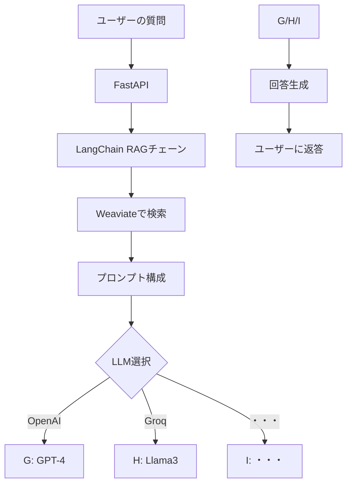

# 🛠️ai-chat-backend

ai-chat-backendは、マルチLLM対応AIチャットAPIエンジンです。

◆ ユースケース
* コールセンターやサポートデスクの自動化
* 社内ヘルプデスク（IT・人事・総務）の自動応答
* ナレッジベース連携型FAQチャットボット
* 営業・提案支援チャット（CRM連携）

---

## 「LangChain + Weaviate + 切り替え可能なLLM（OpenAI/Groq） + API呼び出し + 無料Embedding」(RAG)に基づくチャットアプリケーション構成設計と実装案

---

### 使用技術

- **各LLM API**: AIエンジン
- **FastAPI/SwaggerUI**: REST API
- **Weaviate**: ベクトルデータベース
- **LangChain**: LLMアプリケーションの開発用フレームワーク

### システム構成図

```
[ユーザー画面] 
    │
    ▼
[FastAPIサービス]  ← 呼び出し → [LangChain RAG処理]
    │                          │
    ▼                          ▼
[WeaviateベクトルDB]      [LLMプロバイダー]
    ▲                     ├─ OpenAI
    │                     ├─ Groq
    │                     └─ その他LLM
    │
[無料Embeddingモデル]
```

---

### 📦 構成ファイル

```
freeAiChat
├─ LICENSE                             ← ライセンス
├─ README                              ← 説明
├─ requirements.txt                    ← 必須パッケージ一覧
├─ app.py                              ← コアサービス
├─ init_weaviate.py                    ← Weaviate初期化
└─ docker-compose.yml                  ← Weaviate docker
```

### コアコンポーネント実装

#### 1. 環境準備 (`requirements.txt`)

```python
langchain-core
langchain-community
langchain-openai
langchain-groq
langchain-weaviate
langchain-huggingface
weaviate-client>=4.0.0
sentence-transformers  # 無料Embedding
fastapi
uvicorn
python-dotenv
python-multipart
pypdf
beautifulsoup4
requests
```

```bash
# 仮想環境の作成
python3 -m venv venv
source venv/bin/activate

# 必要なパッケージをインストール
pip install -r requirements.txt
```

#### 2. 環境設定 (`.env`)

```env
# LLM設定
OPENAI_API_KEY=your_openai_key
GROQ_API_KEY=your_groq_key
LLM_PROVIDER=groq  # 切り替え可能：openai または groq

# Weaviate設定
WEAVIATE_URL=http://localhost:8080
WEAVIATE_INDEX_NAME=knowledge_base

# そのた環境変数
UPLOADED_FILES_DIR=/upload_files_path
```

#### 3. コアサービス (`app.py`)

[app.py](./app.py)  をご参照ください。


#### 4. Weaviate 初期化 (`init_weaviate.py`)

[init_weaviate.py](./init_weaviate.py) をご参照ください。


---

### システム動作フロー

#### 1. **ナレッジベース構築**

* ユーザーが `/ingest /upload /ingest-url` API を通じてテキストをアップロード
* 無料の `sentence-transformers` でEmbeddingを生成
* データは Weaviate ベクトルDBに保存

#### 2. **質問応答フロー**



#### 3. **LLM切り替え機構**

* 環境変数 `LLM_PROVIDER` による制御
* コードを変更せずにLLMを切り替え可能
* 実行中の動的切り替えにも対応

---

### デプロイと使用方法

#### 1. サービス起動

```bash
# Weaviate 起動(初回)
docker-compose up -d

初回以降
docker ps         #コンテナー一覧
docker stop       #コンテナー停止
docker start      #コンテナー開始

# Weaviateインデックスの初期化
python init_weaviate.py

# APIサービス起動
uvicorn app:app --reload
```

#### 2.APIドキュメント（Swagger UIより自動生成）
本システムではSwagger UIを利用しており、APIの仕様書が自動的に生成されます。
APIサービスを起動後、ブラウザで以下のURLにアクセスすることで、Swagger UIによるAPIドキュメントを確認できます。

```ブラウザ url
"http://localhost:8000/docs"
```

#### 3. ナレッジ追加API使用例

```bash
# 文言よりナレッジ追加API
curl -X POST "http://localhost:8000/ingest" \
-H "Content-Type: application/json" \
-d '{"text": "LangChainは大規模言語モデルアプリケーションの開発用フレームワークです..."}'
```

```bash
# アップロードファイル（pdfまたはtxt）よりナレッジ追加API
curl -X POST "http://localhost:8000/upload/" \ 
-F "file=@/file_path/file_name.pdf" \
-F "chunk_size=2000" \
-F "preprocess=true"
```

```bash
# 指定URLよりナレッジ追加API
curl -X POST "http://localhost:8000/ingest-url" \
-H "Content-Type: application/json" \
-d '{"url": "https://example.com", "chunk_size": 1500, "preprocess": true}'
```

#### 4. 質問API使用例

```bash
curl -X POST "http://localhost:8000/ask" \
-H "Content-Type: application/json" \
-d '{"question": "LangChainとは何ですか？"}'
```
応答結果
```bash
curl -X POST "http://localhost:8000/ask" -H "Content-Type: application/json" -d '{"question": "LangChainとは何ですか？"}'
{"answer":"LangChainは大規模言語モデルアプリケーションの開発用フレームワークです。"}
```
---

### 特長とメリット

1. **コスト最適化**

   * 無料のオープンソースEmbeddingモデルを使用
   * 高性能かつ低コストなLLM（Groq vs OpenAI）を切り替え可能

2. **柔軟なアーキテクチャ**

   * 環境変数でLLMプロバイダーを簡単に切り替え可能
   * 他のLLM（Anthropicやローカルモデルなど）への拡張も対応可能（今後の予定）

3. **プロダクション対応**

   * 標準的なAPIインターフェース
   * モジュール設計により拡張性確保
   * ベクトル検索と生成処理を分離

4. **高パフォーマンス**

   * Groqは超低遅延応答を提供（リアルタイムシナリオに最適）
   * Weaviateはベクトル検索のパフォーマンスを最適化

---

このソリューションは、コストと性能のバランスが求められるナレッジベース型QA（質問応答）アプリケーションに特に適しており、実運用において無料のEmbeddingモデルを活用しつつ、要件に応じてLLMプロバイダーを柔軟に選択できます。


