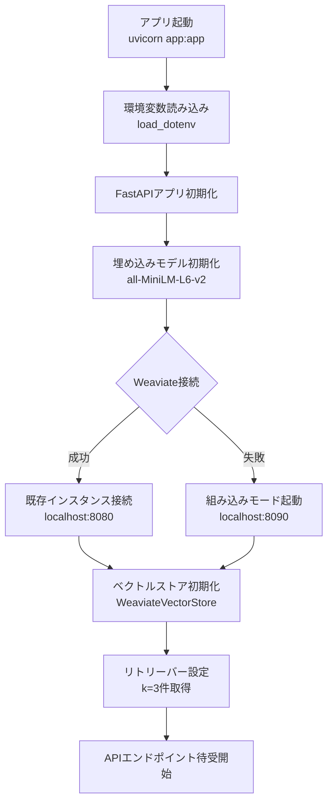
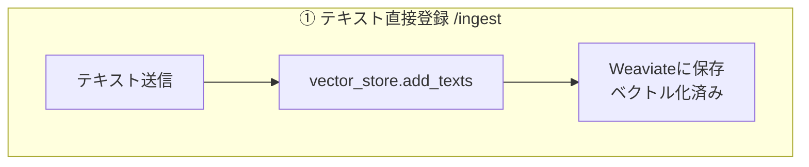
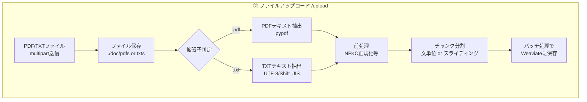
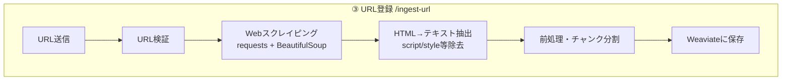
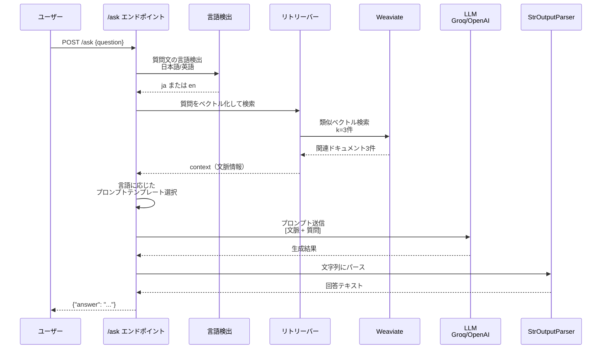
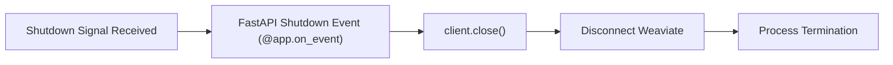
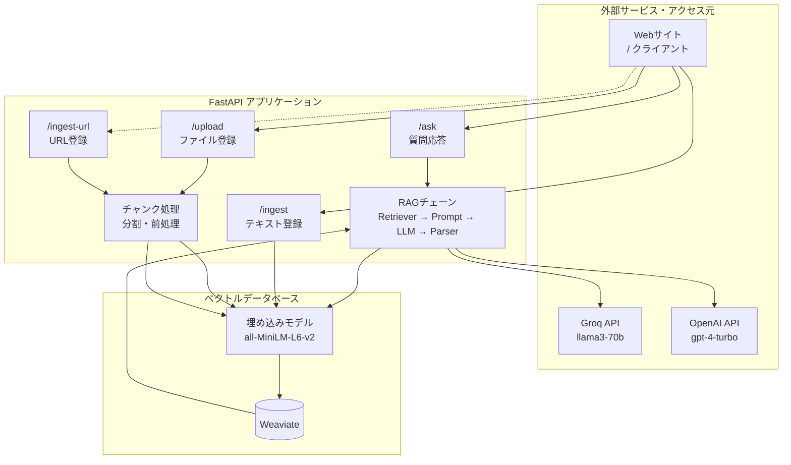

# 🛠️ai-chat-backend

ai-chat-backendは、マルチLLM対応AIチャットAPIエンジンです。
>また、APIエンジンは **Groq（LPU）を利用することで、LLM推論コストを完全無料で運用できます。**
OpenAI / Groq を環境変数で切り替え可能なため、用途に応じて「高速・無料」「高品質モデル」を柔軟に選択できます。

〇 ユースケース
* コールセンターやサポートデスクの自動化
* 社内ヘルプデスク（IT・人事・総務）の自動応答
* ナレッジベース連携型FAQチャットボット
* 営業・提案支援チャット（CRM連携）

<!--
〇 [AI開発に関する技術資料](https://github.com/8alfalfa8/Tec-Doc/tree/main/02_%E6%8A%80%E8%A1%93/AI)
-->

---

## 「LangChain + Weaviate + 切り替え可能なLLM（OpenAI/Groq） + API呼び出し + 無料Embedding」(RAG)に基づくチャットアプリケーション構成設計と実装案

---

### ◆ 使用技術

- **各LLM API**: AIエンジン（OpenAI/Groq）
- **FastAPI/SwaggerUI**: REST API
- **Weaviate**: ベクトルデータベース
- **LangChain**: LLMアプリケーションの開発用フレームワーク

---

### ◆ システム構成図

#### ① 登録系処理フロー（データの流れ込み）

```
[ユーザー画面（Webブラウザ/クライアント）]
    │
    ├─ /ingest（テキスト登録）
    ├─ /upload（ファイル登録）
    └─ /ingest-url（URL登録）
                │
                ▼
         [FastAPIサービス]
                │
                ▼
       [前処理・チャンク分割]
                │
                ▼
         [Embeddingモデル]
                │
                ▼
        [WeaviateベクトルDB]
```

---

#### ② 質問応答系処理フロー（データの引き出し）

```
[ユーザー画面（Webブラウザ/クライアント）]
    │
    └─ /ask（質問応答）
                │
                ▼
         [FastAPIサービス]
                │
                ▼
         [RAG処理（/ask）]
                │
                ▼
          [リトリーバー]
                │
                ▼
        [WeaviateベクトルDB]
                │
                ▼
        [関連文脈（上位3件）]
                │
                ▼
        [LangChain RAG処理]
                │
                ▼
         [LLMプロバイダー]
                ├─ OpenAI
                ├─ Groq
                └─ その他LLM
                    │
                    ▼
                [回答生成]
                    │
                    ▼
            [ユーザー画面へ返却]
```

---

#### 補足：2つのフローの関係

| フロー | 役割 | イメージ |
|--------|------|---------|
| **登録系** | ドキュメントをベクトル化して **Weaviateに蓄積** する | 「本棚に本を並べる」 |
| **質問応答系** | Weaviateから **関連情報を引き出し**、LLMで回答を作る | 「本棚から必要な本を探して、内容を要約して伝える」 |

登録系で貯めた知識が、質問応答系で検索・参照されることで、RAG（検索拡張生成）が成立しています。

---

### ◆ 構成ファイル

```
freeAiChat
├─ .env                                ← 環境設定
├─ README                              ← 説明
├─ requirements.txt                    ← 必須パッケージ一覧
├─ app.py                              ← コアサービス
├─ init_weaviate.py                    ← Weaviate初期化
└─ docker-compose.yml                  ← Weaviate docker
```

### ◆ コアコンポーネント実装

#### 1. 環境準備

- 前提
  - Docker（Docker Desktop）
  - Linux（動作確認：Winodws WSL2 - Ubuntu24）
  - Python3インストール済み(Python 3.10.13)

- 必要なパッケージ(`requirements.txt`)

```python
langchain-core
langchain-community
langchain-openai
langchain-groq
langchain-weaviate
langchain-huggingface
weaviate-client>=4.0.0
sentence-transformers  # 無料Embedding
fastapi
uvicorn
python-dotenv
python-multipart
pypdf
beautifulsoup4
requests
```

- 仮想環境の作成（Linux：Winodws WSL2 - Ubuntu24）

```bash
# Linux仮想環境の作成
python3 -m venv venv
python3 -m pip install --upgrade pip
source venv/bin/activate

# 必要なパッケージをインストール
pip install -r requirements.txt
```

```
# ※Pythonの仮想環境（venv）を無効化する方法
deactivate
```

#### 2. 環境設定 (`.env`)

```env
# LLM設定
OPENAI_API_KEY=your_openai_key
GROQ_API_KEY=your_groq_key
LLM_PROVIDER=groq  # 切り替え可能：openai または groq

# Weaviate設定
WEAVIATE_URL=http://localhost:8080
WEAVIATE_INDEX_NAME=knowledge_base

# そのた環境変数
UPLOADED_FILES_DIR=/upload_files_path
```
#### 3. Weaviate 初期化 (`init_weaviate.py`)

[init_weaviate.py](./init_weaviate.py) をご参照ください。


#### 4. コアサービス (`app.py`)

[app.py](./app.py)  をご参照ください。


##### ①アプリケーション起動時の初期化フロー


```mermaid
flowchart TD
    A[アプリ起動<br/>uvicorn app:app] --> B[環境変数読み込み<br/>load_dotenv]
    B --> C[FastAPIアプリ初期化]
    C --> D[埋め込みモデル初期化<br/>all-MiniLM-L6-v2]
    D --> E{Weaviate接続}
    E -->|成功| F[既存インスタンス接続<br/>localhost:8080]
    E -->|失敗| G[組み込みモード起動<br/>localhost:8090]
    F --> H[ベクトルストア初期化<br/>WeaviateVectorStore]
    G --> H
    H --> I[リトリーバー設定<br/>k=3件取得]
    I --> J[APIエンドポイント待受開始]
```

**ポイント：**
- 起動時に **埋め込みモデル**（文章をベクトル化するモデル）と **Weaviate**（ベクトルDB）を初期化
- Weaviateへの接続に失敗した場合は、組み込みモードで自動起動するフォールバック機構あり
- リトリーバーは「質問に近い文章を上位3件取得する」設定

---

##### ②ドキュメント登録フロー（3つの経路）


```mermaid
flowchart TD
    subgraph 経路1["① テキスト直接登録 /ingest"]
        A1[テキスト送信] --> A2[vector_store.add_texts]
        A2 --> A3[Weaviateに保存<br/>ベクトル化済み]
    end
```


```mermaid
flowchart TD
    subgraph 経路2["② ファイルアップロード /upload"]
        B1[PDF/TXTファイル<br/>multipart送信] --> B2[ファイル保存<br/>./doc/pdfs or txts]
        B2 --> B3{拡張子判定}
        B3 -->|.pdf| B4[PDFテキスト抽出<br/>pypdf]
        B3 -->|.txt| B5[TXTテキスト抽出<br/>UTF-8/Shift_JIS]
        B4 --> B6[前処理<br/>NFKC正規化等]
        B5 --> B6
        B6 --> B7[チャンク分割<br/>文単位 or スライディング]
        B7 --> B8[バッチ処理で<br/>Weaviateに保存]
    end
```


```mermaid
flowchart TD
    subgraph 経路3["③ URL登録 /ingest-url"]
        C1[URL送信] --> C2[URL検証]
        C2 --> C3[Webスクレイピング<br/>requests + BeautifulSoup]
        C3 --> C4[HTML→テキスト抽出<br/>script/style等除去]
        C4 --> C5[前処理・チャンク分割]
        C5 --> C6[Weaviateに保存]
    end
```

**ポイント：**
- **3つの登録経路**があり、最終的にすべて Weaviate にベクトル化して保存される
- PDFは **文単位でチャンク分割**（文末で区切る）、TXT/URLは **スライディングウィンドウ**（固定長でオーバーラップあり）
- 前処理は「全角半角統一」「不要な空白除去」「文末スペース追加」など

---

##### ③質問応答フロー（RAG = Retrieval-Augmented Generation）


```mermaid
sequenceDiagram
    participant User as ユーザー
    participant API as /ask エンドポイント
    participant Detect as 言語検出
    participant Retriever as リトリーバー
    participant Weaviate as Weaviate
    participant LLM as LLM<br/>Groq/OpenAI
    participant Parser as StrOutputParser

    User->>API: POST /ask {question}
    API->>Detect: 質問文の言語検出<br/>日本語/英語
    Detect-->>API: ja または en
    API->>Retriever: 質問をベクトル化して検索
    Retriever->>Weaviate: 類似ベクトル検索<br/>k=3件
    Weaviate-->>Retriever: 関連ドキュメント3件
    Retriever-->>API: context（文脈情報）
    API->>API: 言語に応じた<br/>プロンプトテンプレート選択
    API->>LLM: プロンプト送信<br/>[文脈 + 質問]
    LLM-->>API: 生成結果
    API->>Parser: 文字列にパース
    Parser-->>API: 回答テキスト
    API-->>User: {"answer": "..."}
```

**ポイント：**
- **RAGの流れ**：①質問をベクトル化 → ②Weaviateで類似検索 → ③検索結果を「文脈」としてLLMに渡す → ④LLMが回答を生成
- 質問の言語を自動検出し、**日本語なら日本語のプロンプト**、英語なら英語のプロンプトを使用
- LLMは環境変数 `LLM_PROVIDER` で切り替え（Groq / OpenAI）

---

#### ④シャットダウン時の処理


```mermaid
flowchart LR
    N1["Shutdown Signal Received"] --> N2["FastAPI Shutdown Event (@app.on_event)"]
    N2 --> N3["client.close()"]
    N3 --> N4["Disconnect Weaviate"]
    N4 --> N5["Process Termination"]
```

※Shutdown Signal Received：終了シグナル受信

※Disconnect Weaviate：Weaviate接続切断

※Process Termination：プロセス終了


---

##### 全体アーキテクチャ図（俯瞰）


```mermaid
flowchart TB
    subgraph 外部["外部サービス・アクセス元"]
        Web[Webサイト<br/>/ クライアント]
        Groq[Groq API<br/>llama3-70b]
        OpenAI[OpenAI API<br/>gpt-4-turbo]
    end

    subgraph FastAPI["FastAPI アプリケーション"]
        Endpoint1["/ask<br/>質問応答"]
        Endpoint2["/ingest<br/>テキスト登録"]
        Endpoint3["/upload<br/>ファイル登録"]
        Endpoint4["/ingest-url<br/>URL登録"]

        RAG["RAGチェーン<br/>Retriever → Prompt → LLM → Parser"]
        Chunk["チャンク処理<br/>分割・前処理"]
    end

    subgraph 内部DB["ベクトルデータベース"]
        Weaviate[(Weaviate)]
        Embed["埋め込みモデル<br/>all-MiniLM-L6-v2"]
    end

    Web --> Endpoint1
    Web --> Endpoint2
    Web --> Endpoint3
    Web -.-> Endpoint4

    Endpoint1 --> RAG
    RAG --> Embed
    RAG --> Groq
    RAG --> OpenAI
    Embed --> Weaviate

    Endpoint2 --> Embed
    Endpoint3 --> Chunk --> Embed
    Endpoint4 --> Chunk --> Embed

    Weaviate --> RAG
```

---

##### まとめ：データの流れ

| フェーズ | 入力 | 処理 | 出力先 |
|---------|------|------|--------|
| **登録** | テキスト / PDF / TXT / URL | 抽出 → 前処理 → チャンク分割 → ベクトル化 | Weaviate（ベクトルDB） |
| **検索** | ユーザーの質問文 | 質問をベクトル化 → 類似度検索（k=3） | 関連ドキュメント |
| **生成** | 関連ドキュメント + 質問 | プロンプト構築 → LLM推論 | 回答テキスト |

この流れにより、「アップロードしたドキュメントの内容に基づいてAIが回答する」というRAGチャットボットが実現されています。

---

### ◆ デプロイと使用方法

#### 1. サービス起動

- Dockerの構築（Windows PowerShell）

```PowerShell
# Weaviate 起動(初回)
docker-compose up -d

初回以降
docker ps -a                    #コンテナー一覧
docker start {CONTAINER ID}     #コンテナー開始
docker stop {CONTAINER ID}      #コンテナー停止
```

- サービス起動（Linux:Winodws WSL2 - Ubuntu24)

```bash
source venv/bin/activate
# Weaviateインデックスの初期化
python init_weaviate.py

# APIサービス起動
uvicorn app:app --reload
```

#### 2.APIドキュメント（Swagger UIより自動生成）
本システムではSwagger UIを利用しており、APIの仕様書が自動的に生成されます。
APIサービスを起動後、ブラウザで以下のURLにアクセスすることで、Swagger UIによるAPIドキュメントを確認できます。

```ブラウザ url
"http://localhost:8000/docs"
```

#### 3. ナレッジ追加API使用例

```bash
# 文言よりナレッジ追加API
curl -X POST "http://localhost:8000/ingest" \
-H "Content-Type: application/json" \
-d '{"text": "LangChainは大規模言語モデルアプリケーションの開発用フレームワークです..."}'
```

```bash
# アップロードファイル（pdfまたはtxt）よりナレッジ追加API
curl -X POST "http://localhost:8000/upload/" \
-F "file=@/file_path/file_name.pdf" \
-F "chunk_size=2000" \
-F "preprocess=true"
```

```bash
# 指定URLよりナレッジ追加API
curl -X POST "http://localhost:8000/ingest-url" \
-H "Content-Type: application/json" \
-d '{"url": "https://example.com", "chunk_size": 1500, "preprocess": true}'
```

#### 4. 質問API使用例

```bash
curl -X POST "http://localhost:8000/ask" \
-H "Content-Type: application/json" \
-d '{"question": "LangChainとは何ですか？"}'
```
応答結果
```bash
curl -X POST "http://localhost:8000/ask" -H "Content-Type: application/json" -d '{"question": "LangChainとは何ですか？"}'
{"answer":"LangChainは大規模言語モデルアプリケーションの開発用フレームワークです。"}
```
---

### ◆ 特長とメリット

1. **コスト最適化**

   * 無料のオープンソースEmbeddingモデルを使用
   * 高性能かつ低コストなLLM（Groq vs OpenAI）を切り替え可能

2. **柔軟なアーキテクチャ**

   * 環境変数でLLMプロバイダーを簡単に切り替え可能
   * 他のLLM（Anthropicやローカルモデルなど）への拡張も対応可能（今後の予定）

3. **プロダクション対応**

   * 標準的なAPIインターフェース
   * モジュール設計により拡張性確保
   * ベクトル検索と生成処理を分離

4. **高パフォーマンス**

   * Groqは超低遅延応答を提供（リアルタイムシナリオに最適）
   * Weaviateはベクトル検索のパフォーマンスを最適化

---

このソリューションは、コストと性能のバランスが求められるナレッジベース型QA（質問応答）アプリケーションに特に適しており、実運用において無料のEmbeddingモデルを活用しつつ、要件に応じてLLMプロバイダーを柔軟に選択できます。
