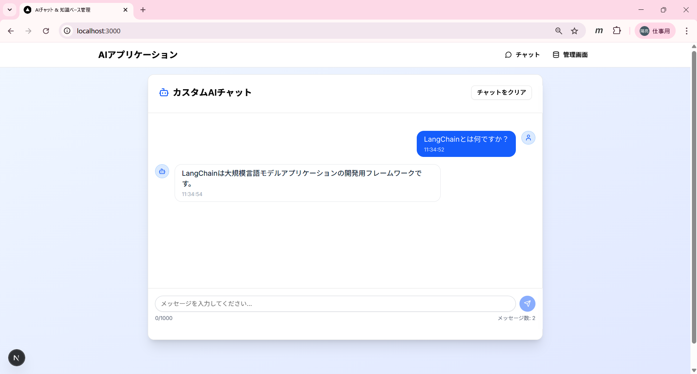
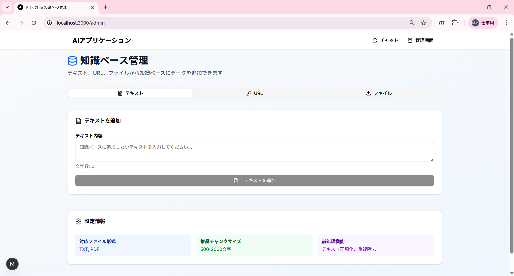

# 🛠️ai-chat-frontend

ai-chat-frontend は、同一リポジトリ内の 「ai-chat-backend」のAPI を利用して構築された、チャットボット用のフロントエンドです。
本フロントエンドは、React.js と shadcn/ui を用いて開発されており、ユーザーインターフェースの表示およびチャット機能の画面処理を担当します。

## 主な機能

- **リアルタイムチャット**: ai-chat-backend APIを使用してストリーミング対応
- **レスポンシブデザイン**: モバイルとデスクトップに対応
- **自動スクロール**: 新しいメッセージが追加されると自動的にスクロール
- **ローディング状態**: メッセージ送信中の視覚的フィードバック
- **エラーハンドリング**: 詳細なエラー表示
- **メッセージ履歴**: 会話の文脈を保持
- **チャットクリア**: 会話履歴のリセット
- **文字数制限**: 入力文字数の表示と制限
- **タイムスタンプ**: メッセージの送信時刻表示

## 画面イメージ
①チャット画面


②管理画面


## 使用技術

- **ai-chat-backend**: マルチLLM対応AIチャットAPIエンジン
- **React/Next.js**: フロントフレームワーク
- **shadcn/ui**: モダンなUIコンポーネント
- **Tailwind CSS**: スタイリング


このチャットアプリケーションを実行するための環境構築手順を説明します。

## 前提条件

### 1. ai-chat-backendが起動されること
ai-chat-backendの起動はai-chat-backendのREADMEをご参照ください。

### 2. Node.jsのインストール

```shellscript
# Node.js 18以上が必要
node --version
npm --version
```

Node.jsがインストールされていない場合：

- [Node.js公式サイト](https://nodejs.org/)からダウンロード
- または、nvmを使用してインストール


## 環境構築手順

### 1. 環境変数の設定

プロジェクトルートに`.env.local`ファイルを作成：

```shellscript
# .env.localファイルを作成
touch .env.local
```

`.env.local`の内容：

```plaintext
# FastAPIのエンドポイント
FASTAPI_URL=http://localhost:8000

# FastAPI APIキー（必要な場合）
FASTAPI_API_KEY=your-fastapi-key-here
```

### 2. ファイル構成
```
ai-chat-frontend/
├── public/
│   └── ...
├── src/
│   ├── app/
│   │    ├── admin/
│   │    │   └── page.tsx
│   │    ├── api/
│   │    │   ├── admin/
│   │    │   │   └── ingest/
│   │    │   │       ├── file/
│   │    │   │       │   └── route.ts
│   │    │   │       ├── text/
│   │    │   │       │   └── route.ts
│   │    │   │       └── url/
│   │    │   │           └── route.ts
│   │    │   └── chat/
│   │    │       └── route.ts
│   │    ├── globals.css
│   │    ├── layout.tsx
│   │    └── page.tsx
│   ├── components/
│   │    └── ui/
│   │        ├── avatar.tsx
│   │        ├── button.tsx
│   │        ├── card.tsx
│   │        ├── input.tsx
│   │        └── scroll-area.tsx
│   └── lib/
│        └── utils.ts
├── .env.local
├── components.json
├── eslint.config.mjs
├── next.env.d.js
├── next.config.js
├── package-lock.json
├── package.json
├── postcss.config.mjs
├── README.md
└── tsconfig.json
```

### 5. 開発サーバーの起動

```shellscript
# 開発サーバーを起動
npm run dev

# または
yarn dev

# または
pnpm dev
```

ブラウザで `http://localhost:3000` にアクセスしてアプリケーションを確認できます。

## 本番環境へのデプロイ

### Vercelへのデプロイ（推奨）

```shellscript
# Vercel CLIをインストール
npm install -g vercel

# Vercelにデプロイ
vercel

# 環境変数をVercelに設定
vercel env add FASTAPI_URL
vercel env add FASTAPI_API_KEY
```

### その他のプラットフォーム

#### Netlify

```shellscript
# ビルド
npm run build

# distフォルダをNetlifyにアップロード
```

#### Docker

```dockerfile
# Dockerfile
FROM node:18-alpine

WORKDIR /app
COPY package*.json ./
RUN npm ci --only=production

COPY . .
RUN npm run build

EXPOSE 3000
CMD ["npm", "start"]
```

## トラブルシューティング

### よくある問題と解決方法

#### 1. shadcn/uiコンポーネントが見つからない

```shellscript
# components.jsonを確認
cat components.json

# 必要なコンポーネントを再インストール
npx shadcn@latest add avatar button card input scroll-area
```

#### 2. TypeScriptエラー

```shellscript
# 型定義を確認
npm run type-check

# 必要に応じて型定義をインストール
npm install --save-dev @types/node @types/react @types/react-dom
```

#### 3. 環境変数が読み込まれない

- `.env.local`ファイルがプロジェクトルートにあることを確認
- サーバーを再起動
- 環境変数名が`NEXT_PUBLIC_`で始まっていない場合、サーバーサイドでのみ利用可能


#### 4. APIエンドポイントエラー

```shellscript
# ログを確認
npm run dev

# ネットワークタブでAPIリクエストを確認
# ブラウザの開発者ツールを使用
```

## パフォーマンス最適化

### 1. ビルド最適化

```shellscript
# 本番ビルド
npm run build

# ビルドサイズを分析
npm install --save-dev @next/bundle-analyzer
```

### 2. 画像最適化

```javascript
// next.config.js
/** @type {import('next').NextConfig} */
const nextConfig = {
  images: {
    domains: ['your-api-domain.com'],
  },
}

module.exports = nextConfig
```

## 開発ツール

### 推奨VS Code拡張機能

- ES7+ React/Redux/React-Native snippets
- Tailwind CSS IntelliSense
- TypeScript Importer
- Prettier - Code formatter
- ESLint


### package.jsonスクリプト

```json
{
  "scripts": {
    "dev": "next dev",
    "build": "next build",
    "start": "next start",
    "lint": "next lint",
    "type-check": "tsc --noEmit"
  }
}
```

この手順に従って環境を構築すれば、チャットアプリケーションを正常に実行できます。


